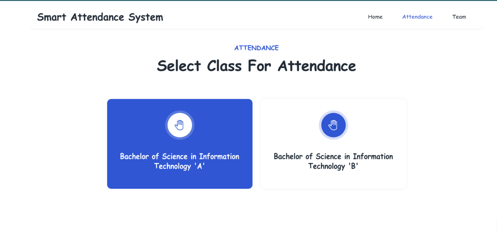

# Smart Attendance System using Facial Recognition

_Gyalpozhing College of Information 
Technology(Bachelor of Science in Information 
Technology(BScIT)) Year 3 Project_

# Description
  
All organizations need an attendance management system to maintain a record of their staff attendance. Especially in the universities and schools, student’s daily attendance in class is essential to maintain discipline and success in academics. Roll call or student signing on attendance sheet is the traditional methods that has long been adopted by most of the organizations especially universities and schools. This is both time consuming and not secure. In Most of the universities, the ones who takes the attendance especially the lecturers face challenges such as calling the students name, letting them sign the attendance sheet where the students might do proxy (signing on behalf of others) and also, there is a high possibility of missing out some students while calling student names. As a result, some students could be marked absent while they are actually present in class. Moreover, it becomes tedious to keeps records of every student and referring it. Thus, to overcome all those constraints, the most suitable method to ensure full security and to save history records digitally is through smart attendance system using face recognition. Smart Attendance System is a web based application that will mark the attendance of the student through facial recognition and allowe user to view attendance record and perform CRUD operation on the attenadnce records.

# Technology Used
1. Face Recognition
2. openCV
3. Visual Studio Code
4. Python
6. Django 
7. SQLite3

## Video
Watch video here : 
(https://www.youtube.com/watch?v=EOTadXh3WZY)

## Website (Heroku)
Click here : 
(https://gcit-attendance-system.herokuapp.com/)

## Screenshoot of Smart Attendance System Website
  
  
  
  
  
  
  
  
  

# Poster

